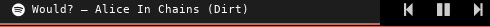

# polybar-spotify
Small script to get Spotify control to work with Polybar

## Spotify Control and Polybar

In order to have this to work you need to have

* Polybar working
* Python `dbus` module installed
* Python 3

## Idea

The idea is to have a simple way to see Spotify music playing and simple controls to pause/play
songs and to go to previous/next song.

## Limitations

The main limitation is that in order to get the name of the song being played and the play/pause
icon correct, the script needs to be executed often.

The second limitation is that Spotify application doesn't expose the current position in the song,
so we cannot show a fancy progress bar of the song.

## Configuration

I deliberately wrote a script that could do all I needed and then split the functionalities in
different polybar modules.

The result was something like the following:

```
[...]

modules-left = spotify-song spotify-backward spotify-status spotify-forward

[...]
[module/spotify-song]
type = custom/script
exec = ~/polybar-scripts/spotify-cmd.py --playing --trim_or_pad 50
interval = 0.5
format = <label>
format-foreground = #fff
format-background = #773f3f3f
format-underline = #c9665e
format-padding = 4
label = %{T4}%output%%{T-}

[module/spotify-backward]
type = custom/script
exec = ~/polybar-scripts/spotify-cmd.py --previous_icon
click-left = ~/polybar-scripts/spotify-cmd.py --previous
format-padding = -1

[module/spotify-status]
type = custom/script
exec = ~/polybar-scripts/spotify-cmd.py --playpause_icon
click-left = ~/polybar-scripts/spotify-cmd.py --playpause
interval = 0.5
format-padding = -1

[module/spotify-forward]
type = custom/script
exec = ~/polybar-scripts/spotify-cmd.py --next_icon
click-left = ~/polybar-scripts/spotify-cmd.py --next
format-padding = -1
[bar/top]

```

Few things to notice:

* The custom font usage in the `spotify-song` block is not casual. Since the blocks are separated,
  the best result is obtained with monospace fonts, so that the width of the block is fixed.
* `print("\uf048")` and `print("\uf051")` commands are just printing icons for previous/next song.
  This can be done in the script itself with a little addition.

## Outcome

When a song is playing, the result is like this:



When a song is paused, the result is like this:


Note that the script trims or pads the output to a fixed amount of characters, that together with a
monospace font produce the result of a fixed width polybar block.

